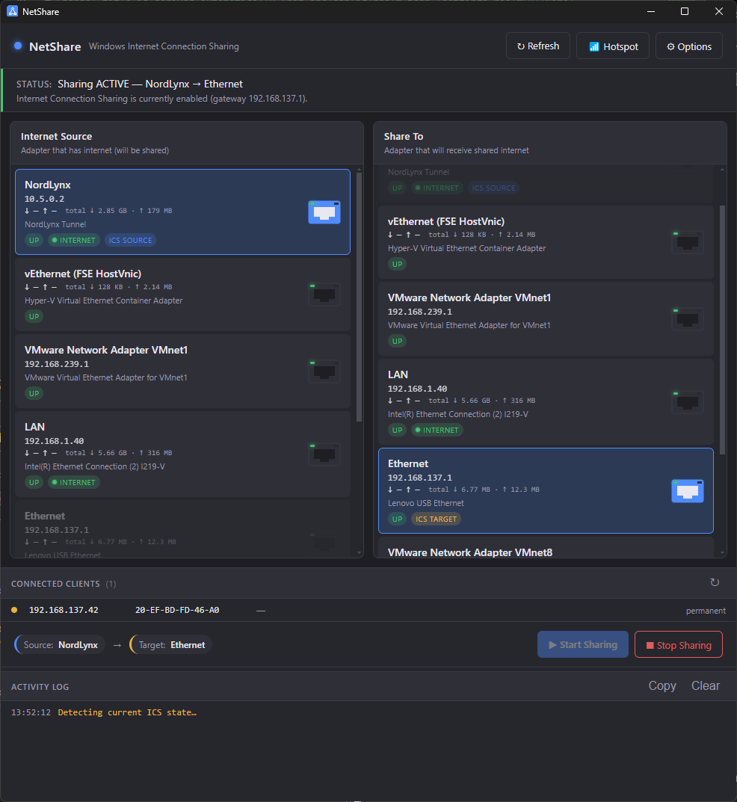

# NetShare

A small Electron desktop app for managing **Windows Internet Connection Sharing
(ICS)** — pick one adapter as the internet source, pick another as the
recipient, click Start. The app reads live ICS state from Windows on a poll,
so it always reflects what the OS actually has configured (including changes
made from the Network & Sharing Center).



## Features

- **Two-column adapter picker** — left column selects the Internet source
  (the adapter currently providing internet), right column selects the
  receiving adapter. Picking the same adapter on both sides is blocked.
- **Live state detection** — reads the ICS configuration directly from
  Windows (registry + `Get-NetAdapter` + service status). When ICS is already
  on at startup, both toggles light up automatically and the status bar shows
  `Sharing ACTIVE — <source> → <target>`. Default poll interval: **60 s**.
- **External-change awareness** — if you enable/disable ICS from the Windows
  control panel while the app is running, the next poll picks it up and
  raises a toast (`ICS enabled externally: …`, `ICS was disabled outside the
  app`, etc.) without clobbering an in-progress user selection.
- **Universal IP handling** — the ICS gateway IP is read from
  `HKLM:\SYSTEM\CurrentControlSet\Services\SharedAccess\Parameters\ScopeAddress`,
  so the app works on any machine regardless of whether the user has changed
  the default `192.168.137.1`.
- **One-click Start / Stop / Switch** — the Start button auto-relabels to
  `▶ Switch Sharing` when the current selection differs from the live state.
  All toggling goes through the Windows `HNetCfg.HNetShare` COM API.
- **UAC elevation only when needed** — listing adapters and reading ICS state
  works without admin. Enabling/disabling sharing requires admin, so the app
  prompts for elevation only at the moment you click Start or Stop (toggle
  in Options to launch the whole app elevated instead).
- **Options dialog** — auto-refresh interval, show/hide disconnected
  adapters, elevation behavior.
- **Dark UI** with slim accent-matched scrollbars.

## Requirements

- Windows 10 / 11
- Administrator privileges to **change** ICS state (the app prompts via UAC
  on each Start/Stop; you can also launch the whole app elevated)
- PowerShell 5+ (ships with Windows; PowerShell 7 also works)
- Node.js 18+ and npm — only needed for development / building from source

## Install & run from source

```powershell
git clone <repo-url> NetShare
cd NetShare
npm install
npm start              # plain run
npm run dev            # dev mode with hot reload (electronmon)
```

## Build the portable .exe

```powershell
npm run build
```

The output lands in `dist/NetShare-<version>-portable.exe`. It's a single
self-contained executable — copy it anywhere and double-click; no installer
runs, no registry entries are written. Settings are stored in
`%APPDATA%/NetShare/settings.json` once the user changes anything in the
Options dialog.

## How detection works

ICS leaves several footprints in Windows that the app can read **without**
elevation, which is what makes startup-state detection reliable:

| Signal | Source |
|---|---|
| ICS gateway IP (e.g. `192.168.137.1`) | Registry: `HKLM\SYSTEM\CurrentControlSet\Services\SharedAccess\Parameters\ScopeAddress` |
| Target / private adapter | The adapter currently holding that gateway IP (`Get-NetIPAddress`) |
| Source / public adapter | The Up adapter with IPv4 forwarding enabled and a default gateway, excluding the target |
| ICS overall on/off | `SharedAccess` service `Status -eq 'Running'` |

The COM API (`HNetCfg.HNetShare`) requires admin to enumerate connections, so
it's only used for the **write** path (Start / Stop) — never for detection.

## Project layout

```
src/
├── main/                       Electron main process
│   ├── index.js                Entry — app.whenReady + lifecycle
│   ├── window.js               BrowserWindow + icon wiring
│   ├── ipc.js                  ipcMain.handle registration
│   ├── settings.js             %APPDATA% settings load/save
│   ├── powershell.js           PowerShell runner with optional UAC wrapper
│   └── ics.js                  listAdapters / startSharing / stopSharing
├── preload.js                  contextBridge → window.netshare
├── scripts/                    Real .ps1 files, parameterised
│   ├── list-adapters.ps1
│   ├── stop-sharing.ps1
│   └── set-sharing.ps1
└── renderer/
    ├── index.html
    ├── styles.css
    └── js/
        ├── app.js              Orchestrator: refresh loop, action handlers
        ├── api.js              window.netshare re-export
        ├── state.js            Shared state object
        ├── utils.js            el(tag, props, children) helper
        └── views/              One module per UI region
            ├── statusBar.js
            ├── adapterColumn.js  (used for both Source and Target columns)
            ├── footer.js
            ├── optionsModal.js
            └── toast.js
build/
├── icon.ico                    App icon (generated, see make-icon.ps1)
└── make-icon.ps1               Regenerates icon.ico from PowerShell drawing
```

## Regenerating the icon

The icon is drawn programmatically by `build/make-icon.ps1` — a flat
three-node network topology on the app's accent-blue background. To tweak
the design, edit that script and re-run:

```powershell
npm run icon
```

## License

MIT — see [LICENSE](LICENSE).
